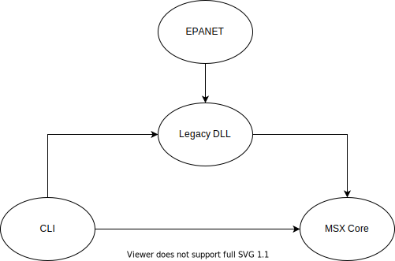

# EPANET-MSX

The multi-species extension to the EPANET hydraulic analysis engine.

## Core Toolkit Usage
Notes:
Make sure that MSX_init() is called after everything is added, this must be done before
any simulations are done. MSX_init() also must be called before Hydraulics are set.


## Building
In order to build, it is easiest to have CMake (https://cmake.org/) installed.
The easiest way to build quickly is to run the bash script titled "build.sh" from
the root directory. If you can't run the bash file, the instructions will be below.

It is important to build all three modules (MSX Core, Legacy DLL, and CLI) in the correct order
as some of them have dependencies on each other.
First, build the MSX Core module since it has no dependencies. Navigate into the MSX Core directory
and create a new directory titled "build". Then navigate into that directory and run the CMake command.
```
mkdir build
cd build
cmake ..
cmake --build . --config Release
```
Next, in order to build the Legacy DLL module, it is necessary to have a built version of the EPANET
repository outside of the epanet-msx repository. Then follow the same steps as used in the MSX Core
compilation.
```
mkdir build
cd build
cmake ..
cmake --build . --config Release
```

Lastly, to compile the CLI module, follow the same steps as used to compile the MSX Core. Note that it is
important that the other two modules were compiled successfully in order for the CLI to compile successfully.
```
mkdir build
cd build
cmake ..
cmake --build . --config Release
```

In order for the executable to work, the following DLL's will need to be in the same directory: "core.dll",
"legacy.dll", and "epanet2.dll". The EPANET 2 DLL is required because it is linked with the Legacy DLL.

## Updates
This repository has gone through some substantial changes that will be highlighted below.

The goal behind the restructuring of EPANET-MSX was to remove dependencies on EPANET as well as dependencies
on the specific (.inp) EPANET input file and the (.msx) MSX input files. This way users can use
EPANET-MSX as a toolkit rather than just through the input files. However it was also an important
feature to maintain complete backwards compatibility.
In order to maintain backwards compatibility in the easiest way possible, the repository was split into
three directories: CLI, Legacy DLL, and MSX Core.
These are structured in such a way to accomplish the goals listed above. 
The MSX Core contains all of the math and chemical reaction code as well as all of the core toolkit
functions needed to create a network (previously done from .inp file using EPANET) and then also to add the species and
reaction information (previously done from .msx file). The MSX Core also contains the function to set
Hydraulics (previously done within EPANET) and step forawrd in the simulation. Lastly there is a function called MSXprintQuality
which can be used to print the quality at the current time step of a specified species and node. This function is an alternate
for the legacy MSXreport function which uses a binary out file to store results and then reads those results from the binary
out file and writes them to the report file (which is still present in the Legacy DLL).
The MSX Core has no dependencies.

The Legacy DLL contains all of the code that is used to parse the EPANET input file as well as the MSX
input file. It also contains the functions to create reports. There is a function called MSXrunLegacy that runs the legacy
main method, it takes in a MSXproject struct as well as argc and argv. All of the dependencies on EPANET are within Legacy DLL.
The Legacy DLL is also dependent on the MSX Core library.

The CLI  is basically just where the main function will be that can used functions from both the MSX Core and the Legacy DLL.
This is where the executable will be created.
The CLI is dependent on whatever it is using, for example in its current state it is dependent on both the Legacy DLL and
MSX Core since both legacytoolkit.c and coretoolkit.c are included.
In order to completely remove the dependencies of the CLI on the Legacy DLL, it is also important to alter the CMake files.

Below is a Diagram to help understand the dependencies of the repository:

